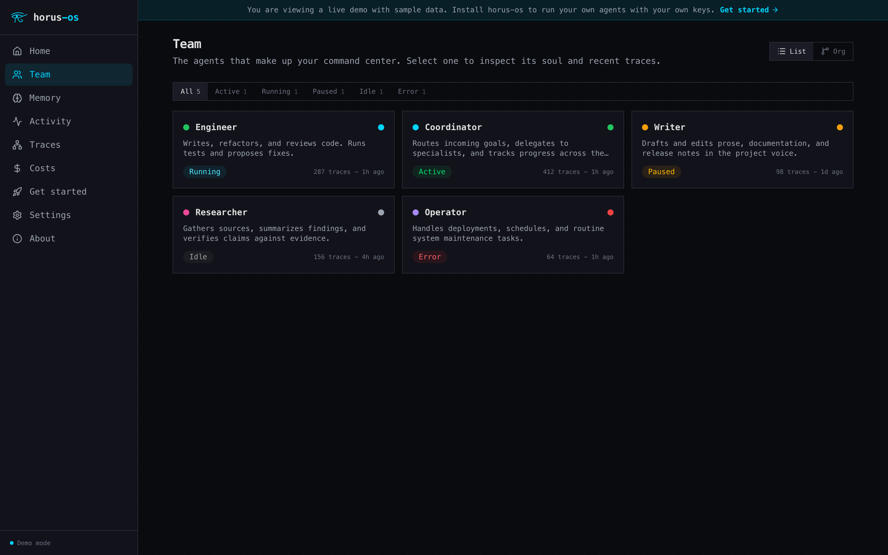
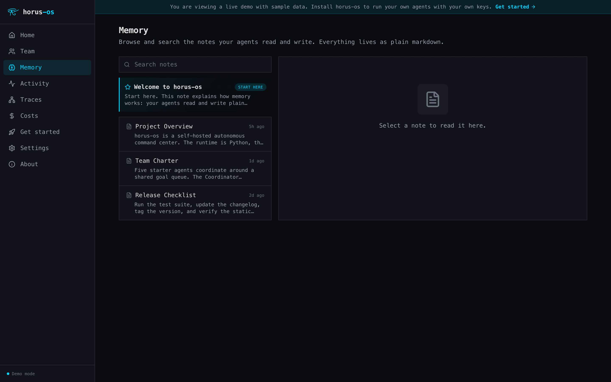
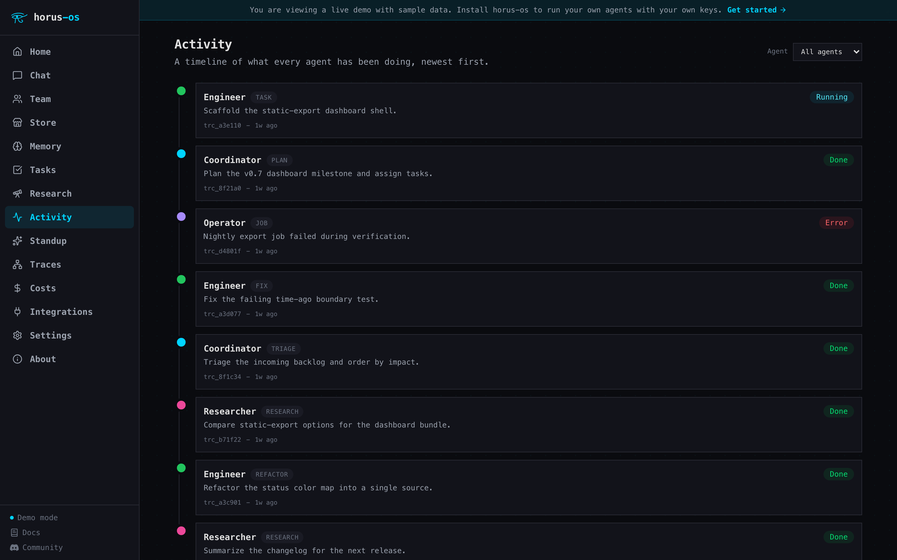
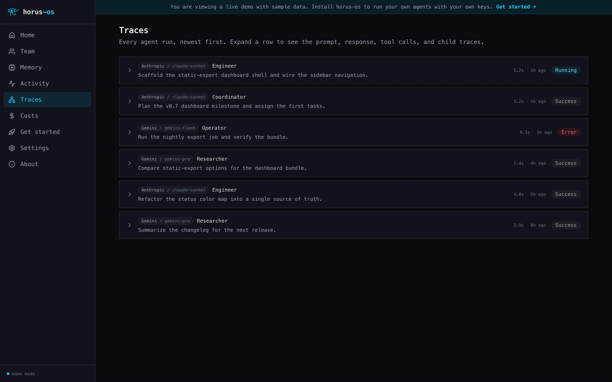
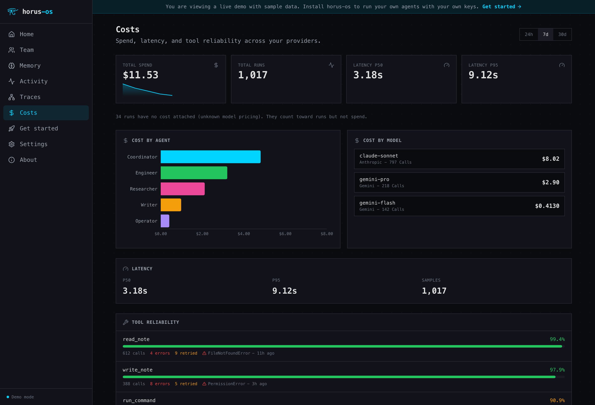
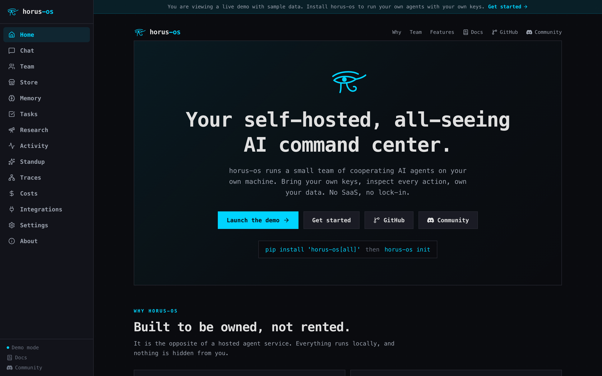

<p align="center">
  
</p>

<p align="center">
  <em>Your self-hosted, all-seeing AI command center. Run it on your machine, inspect everything.</em>
</p>

<p align="center">
  <a href="https://github.com/Ridou/horus-os/actions/workflows/ci.yml"></a>
  <a href="LICENSE"></a>
  
  
  
  <a href="https://discord.gg/vwX9WvwQhp"></a>
</p>

<p align="center">
  <b><a href="https://docs.horus-demo.com">Documentation</a></b>
  &nbsp;&middot;&nbsp; <a href="https://horus-demo.com">Live demo</a>
  &nbsp;&middot;&nbsp; <a href="https://discord.gg/vwX9WvwQhp">Discord</a>
  &nbsp;&middot;&nbsp; <a href="#quickstart">Quickstart</a>
  &nbsp;&middot;&nbsp; <a href="STATUS.md">Status</a>
  &nbsp;&middot;&nbsp; <a href="ROADMAP.md">Roadmap</a>
</p>

---

`horus-os` lets one person run a small team of cooperating AI agents from a single workstation. You give the team a goal through a CLI or a local web dashboard. A coordinator breaks it down and delegates to specialists, the agents work against your notes vault and a tool registry, and every action lands in a trace you can read back. The whole stack runs on your own hardware, billed to your own API keys, and never requires a cloud account to start.

It is the opposite of a hosted agent service: no account to sign up for, no data leaving your machine, no vendor lock-in, and no opaque "magic" you cannot inspect.

<p align="center">
  
  <br><sub>The bundled local dashboard: your agents as an organization, every run traced.</sub>
</p>

## Named for the all-seeing eye

<p align="center">
  
</p>

The Eye of Horus, the Wedjat, was the ancient Egyptian symbol of protection and watchful oversight. horus-os takes the name seriously. You sit at the center of the command center, and nothing your agents do is hidden from you: every decision, every tool call, every memory write is visible, attributed, and reviewable. The agents do the work. The eye is yours.

## What you can do with it

Hand your team a goal in plain language and watch it route the work:

- "Summarize this week's meeting notes and draft a status update." The Coordinator pulls the notes and hands the draft to the Writer.
- "Research the top approaches to retrieval-augmented memory, cite sources, and save the findings to my vault." The Researcher gathers, summarizes, and writes a new note.
- "Read my project notes and list the open risks and decisions." Grounded entirely in the markdown vault you control.
- "Which of my tools is failing most often this week?" The Operator reads the traces and tells you.
- Wire it to Discord, Slack, Email, or Calendar with opt-in adapters so the team can act where you already work.

Everything above leaves a trace. Open the dashboard and you can see exactly which agent did what, which model it called, what it cost, and what it wrote.

## Why horus-os

| You want | horus-os gives you |
|----------|--------------------|
| To own your stack | Self-hosted, local-first, SQLite on disk. Your data never leaves the machine. |
| To not be locked in | First-class Anthropic and Gemini support through their official SDKs, no abstraction tax. Bring your own keys. |
| To trust the output | Every agent run writes a trace. Every memory write lands in an audit log. Nothing is hidden. |
| A team, not a chatbot | A coordinator delegates to specialists that hand work back and forth. |
| To start in minutes | One `pip install`, one `init`, and you have a seeded team, an example vault, and a dashboard. |

## Quickstart

```bash
pip install 'horus-os[all]'

# Initialize: seeds a starter team, an example vault, and a demo trace.
# --interactive walks you through API keys and validates them live.
horus-os init --interactive
# or: horus-os init && export ANTHROPIC_API_KEY=sk-ant-...   (and/or GEMINI_API_KEY)

# Ask your team something
horus-os run "Summarize today's notes and list the open TODOs."

# Drive a specific agent
horus-os agents list
horus-os run --agent Researcher "Find three sources on retrieval-augmented memory."

# Open the local dashboard
horus-os serve        # http://127.0.0.1:8765
```

Need a key first? Grab one from the [Anthropic Console](https://console.anthropic.com/) or [Google AI Studio](https://aistudio.google.com/apikey). A full walkthrough lives on the [Get Started page](https://horus-demo.com/get-started/). horus-os needs at least one provider key, and your keys stay on your machine.

`horus-os init` is not an empty shell. On first run it seeds a five-agent team, a dozen example notes, and a demo trace, so the CLI and the dashboard have something to show immediately. It is all example data you can edit or delete.

## Optional extras

`pip install horus-os` (no extras) installs none of the optional extras and still runs the full local runtime: the CLI, the agent loop, SQLite storage, the vault, and traces all work without any extra. No optional extra activates a feature on a bare install; installing an extra only makes its dependency available, and you still turn the feature on with config or an env flag. Each extra below adds one integration or provider:

| Extra | What it adds |
|-------|--------------|
| `anthropic` | Anthropic Claude provider SDK. |
| `gemini` | Google Gemini provider SDK. |
| `local-llm` | OpenAI-compatible local server (Ollama, llama.cpp, LM Studio, vLLM). |
| `local-memory` | On-device ONNX vector memory (fastembed + sqlite-vec). |
| `mcp` | Model Context Protocol client, opt-in via mcp.toml. |
| `web` | Bring-your-own web search and SSRF-guarded fetch. |
| `pdf` | Pure-Python PDF text extraction. |
| `vision` | Image resize and format conversion for vision calls. |
| `research` | Convenience meta-extra: the full local-first stack in one command. |
| `dashboard` | FastAPI and uvicorn web dashboard server. |
| `discord` | Discord control bot and adapter. |
| `supabase` | Cloud SQLite mirror sync. |
| `slack` | Slack adapter. |
| `calendar` | Google Calendar adapter. |
| `voice` | Twilio voice and reservations adapter for outbound calls. |
| `otel` | OpenTelemetry exporter. |
| `vercel` | Observe-only Vercel deploy client. |
| `github` | Read-only GitHub repository tool. |

The `[research]` meta-extra installs the whole v0.8 infrastructure layer (`local-llm`, `local-memory`, `mcp`, `web`, `pdf`, `vision`) at once. The `[local-memory]` extra pins `onnxruntime>=1.17.0,<1.24.0` so an Intel-macOS wheel is available (1.24.1+ ships arm64 only); for that reason it is kept out of `[all]` and is an explicit opt-in. See [docs/MIGRATION-v0.7-to-v0.8.md](docs/MIGRATION-v0.7-to-v0.8.md) for the full extras table and upgrade notes.

`pip install 'horus-os[all]'` installs the AI providers (`anthropic`, `gemini`), the light v0.8 extras (`local-llm`, `mcp`, `web`, `pdf`, `vision`), and the `dashboard`, `slack`, `calendar`, and `otel` extras. It deliberately EXCLUDES `[local-memory]` (its native onnxruntime wheels need the Intel-macOS pin) and the four opt-in integrations: `[discord]`, `[supabase]`, `[vercel]`, and `[github]`. Install those individually when you want them, for example `pip install 'horus-os[supabase]'` or `pip install 'horus-os[local-memory]'`.

## Your starter team

A fresh install creates five generic agents. Rename them, rewrite their personas, add your own, or delete the ones you do not need. Each one has a `SOUL.md` persona file in your vault.

| Agent | Color | Role |
|-------|:-----:|------|
| **Coordinator** | `#00d4ff` | Routes a request to the right specialist and synthesizes the results into one answer. |
| **Engineer** | `#22c55e` | Handles code and technical work in small, verifiable steps. |
| **Researcher** | `#ec4899` | Gathers and analyzes information and summarizes it with sources. |
| **Writer** | `#f59e0b` | Turns raw material into clear docs, summaries, and content. |
| **Operator** | `#a78bfa` | Watches the running system for tasks, schedules, errors, and health. |

The Coordinator delegates to the others through the built-in `delegate_to_agent` tool. Models are configurable, so the roster degrades gracefully on an Anthropic-only or Gemini-only key.

## The dashboard

A local web dashboard ships with horus-os: a team view with an org chart, a markdown memory browser, a live activity timeline, a traces explorer, a cost and latency overview, settings, and an about page. It is built as a static Next.js export and bundled into the wheel, so end users run it with **no Node and no build step**, just `horus-os serve`. (Node is only needed by contributors who rebuild the dashboard.)

The dashboard talks only to your local backend. There is no hosted service behind it.

<table>
  <tr>
    <td width="50%" align="center"><br><sub><b>Memory</b>, browse and search your markdown vault</sub></td>
    <td width="50%" align="center"><br><sub><b>Activity</b>, a live timeline of what every agent did</sub></td>
  </tr>
  <tr>
    <td align="center"><br><sub><b>Traces</b>, every run with its prompt, model, cost, and tools</sub></td>
    <td align="center"><br><sub><b>Costs</b>, spend, latency, and tool reliability across providers</sub></td>
  </tr>
</table>

<p align="center"><a href="https://horus-demo.com">Explore the live demo</a> (sample data, no backend required).</p>

## What is inside

- **Two providers, your keys.** Anthropic Claude and Google Gemini through the official SDKs, no abstraction layer.
- **A real agent team.** Named profiles in SQLite, a `delegate_to_agent` tool, parent and child traces, streaming responses on the CLI and the dashboard.
- **Tools and memory.** A tool registry plus a markdown notes vault the agents read and write, with every write captured in an audit log. The vault is plain markdown you can edit in any editor, including Obsidian (point an Obsidian vault at your notes folder).
- **Observability.** Per-run cost, latency, and tool-reliability tracking, a costs dashboard, a `horus-os usage` CLI, and an opt-in OpenTelemetry exporter behind an extra.
- **A plugin system.** Third-party tools and adapters load from a `horus-plugin.toml` manifest with default-deny capability grants and per-plugin observability.
- **Adapters.** Optional, opt-in connectors (Discord, Slack, Email, Calendar, and a Twilio voice adapter) so agents can act on the surfaces you choose.
- **Runs everywhere.** Tested on macOS, Ubuntu, and Windows against Python 3.11 and 3.12.

## What is new in v0.8

<p align="center">
  
</p>

v0.8, "Local-first and Autonomous Research," adds a full local-first capability layer and a flagship Deep Research workflow. Every piece is opt-in; a bare `pip install horus-os` still starts with only an LLM key and activates none of the new features.

- **Local LLM provider (opt-in).** Point horus-os at any OpenAI-compatible local server (Ollama, llama.cpp, LM Studio, vLLM, OpenRouter) via the `[local-llm]` extra and a single `base_url` override.
- **On-device vector memory (opt-in).** Local ONNX text embeddings and a `sqlite-vec` KNN index alongside the markdown vault, via the `[local-memory]` extra, with zero network egress on memory writes. Off by default; you opt in and run `horus-os memory download-model` to activate.
- **MCP client (opt-in).** Connect to explicitly-allowlisted Model Context Protocol servers (stdio, SSE, streamable-http) via the `[mcp]` extra. Discovered tools register into the shared tool registry under an `mcp:{server}:{tool}` namespace.
- **Web access and search (opt-in).** Bring-your-own web search (SearXNG, Brave, Tavily) and an SSRF-guarded HTML-to-text fetch via the `[web]` extra.
- **Vision and PDF analysis (opt-in).** Image resize and format conversion via the `[vision]` extra and pure-Python PDF text extraction via the `[pdf]` extra, so an agent can read uploaded files.
- **Deep Research (flagship).** A native coordinator workflow that takes a research question, delegates to a Researcher sub-agent with the web tools, and synthesizes a structured Markdown report with citations. Built on the existing multi-agent delegation runtime, with hard source and iteration caps.
- **Skills system.** Reusable, TOML-defined agent behaviors discovered from `<data_dir>/skills/` and composed at runtime via the `use_skill` tool.
- **Gated shell execution.** A `shell_exec` tool gated by a double lock: it registers only when `HORUS_OS_SHELL_ENABLED=true` AND the agent profile's `allowed_tools` explicitly list it.
- **`[research]` meta-extra.** A single `pip install 'horus-os[research]'` installs the full v0.8 infrastructure layer (`local-llm`, `local-memory`, `mcp`, `web`, `pdf`, `vision`).

Three more product surfaces have since landed on `main`, on top of the v0.8 core. They sit in the `[Unreleased]` section of the [changelog](CHANGELOG.md) and ship in the next tagged cut, they are not part of the v0.8.0 tag:

- **Streaming chat in the dashboard.** A first-class chat surface in the Next.js dashboard that streams tokens live as the team works, not just a buffered final answer.
- **An agent store.** Browse and install featured agent bundles (Atlas, Vitriol, Sol) or build your own with a custom-agent builder, no code required.
- **Voice and reservations (opt-in).** An optional Twilio voice adapter behind the `[voice]` extra for outbound calls and phone reservations.

The next planned milestone is **v0.9, Autonomy and Control**: monetary budgets that pause on breach, risk-tiered approvals, secrets redaction, an event and lifecycle-hook substrate, priority execution lanes, and controlled overnight autonomy that rides behind every gate. It is the first of a six-milestone program (v0.9 through v0.14). See [ROADMAP.md](ROADMAP.md).

<p align="center">
  
  <br><sub>One front door: the marketing landing and the live demo, in a single site.</sub>
</p>

v0.7 (shipped 2026-06-03) shipped the Command Center: a polished Next.js dashboard, a seeded five-agent starter team, an opt-in Discord control bot, an opt-in Supabase sync loop, and a cron scheduler with an always-on service. v0.6 (Contribution Gate) was never tagged, so v0.7.0 follows v0.5.0 directly in the tag history.

Earlier milestones shipped the foundation: the agent runtime and two providers (v0.1), multi-agent delegation and streaming (v0.2), the adapter ecosystem (v0.3), observability (v0.4), and the plugin system (v0.5). See [CHANGELOG.md](CHANGELOG.md) and [ROADMAP.md](ROADMAP.md).

## The potential

The five-agent starter team is the floor, not the ceiling. horus-os is the open core of a system that scales into a full daily command center, and the architecture is deliberately built to grow. This is not hypothetical. The open-source core is extracted from a private command center that runs against real, daily work, and it is built to grow the same way.

- **Memory that compounds.** Today the vault is plain markdown the agents read and write. The roadmap adds a memory pipeline: agents extract structured facts from what they read, consolidate and dedupe them over time, roll up a daily summary, keep short-term working memory separate from long-term recall, and notice when you edit notes outside the system so only what changed gets reindexed. The team gets sharper the longer you run it.
- **A bigger team.** The coordinator-and-specialists shape scales well past five. Give each new agent a SOUL persona, a color, and a domain, and the coordinator routes to it. The dashboard org chart is built for a real team, not a demo.
- **Proactive, on a schedule.** Beyond answering when asked, agents can run on cron-like schedules and work while you are away: an overnight digest, a watch on a feed, an alert when a number crosses a line. The trace log means you can always see what ran and why.
- **A knowledge graph.** As facts accumulate, the entities in your work link into a graph the team can traverse, so "what do we know about this" has a real answer.
- **Meets you where you work.** Adapters and plugins are packages, not forks. New surfaces and tools ship without touching the core.

None of this gives up the core promise. It all runs on your machine, against your keys, with every action traced. See [ROADMAP.md](ROADMAP.md) for what is committed next.

## What horus-os is not

- Not a hosted SaaS or an account you sign up for.
- Not a service that ships your data to a third party.
- Not a single monolithic model behind a chat box.
- Not locked to one LLM vendor.
- Not a multi-tenant platform or a no-code agent builder.

## Status and how to get involved

**horus-os is in solo development mode.** It was open-sourced out of a working private command center that runs against real data on a real machine. v0.8 is the latest shipped release; since the tag, three more product surfaces (streaming chat, an agent store, and an opt-in voice adapter) have landed on `main` ahead of the next cut, and v0.9 (Autonomy and Control) is in planning. The contribution flow opens only once an internal supply-chain readiness gate is met; until then, outside pull requests are acknowledged and closed unreviewed, and issue-claim comments are not honored. [STATUS.md](STATUS.md) has the dated, canonical version of all of this.

You can still help right now, and this feedback is the single most valuable contribution today:

- **Run it against a real workload** and write up what worked and what did not, in [Discussions](https://github.com/Ridou/horus-os/discussions).
- **File a bug** the moment you hit one, in [Issues](https://github.com/Ridou/horus-os/issues).
- **Open a design question** in Discussions before it becomes a PR.
- **Join the [community Discord](https://discord.gg/vwX9WvwQhp)** to ask questions, get help, and share what you built. The `#help` channel is a forum that works as a searchable Q&A, so a good answer stays findable for the next person instead of scrolling away.
- **Star or watch** the repo to follow releases and the status flip.

[CONTRIBUTING.md](CONTRIBUTING.md) documents the dev setup, workflow, and code style that will apply once contributions open.

## Documentation

**The official documentation site is [docs.horus-demo.com](https://docs.horus-demo.com).** Start there: installation, a quickstart, guides for the CLI, dashboard, vault (including editing in Obsidian), autonomous research, scheduling, and every integration, plus a complete CLI, configuration, and environment reference. It is fully searchable.

The docs site source lives in [`docs-site/`](docs-site/) (a static Next.js app deployed to Vercel; see [docs-site/DEPLOY.md](docs-site/DEPLOY.md)). The underlying reference material also lives as markdown in the repo:

- [PROJECT.md](PROJECT.md), project intent, core values, and scope
- [ARCHITECTURE.md](ARCHITECTURE.md), technical shape
- [ROADMAP.md](ROADMAP.md), current milestone and what comes next
- [docs/CLI.md](docs/CLI.md), the command-line surface
- [docs/PLUGINS.md](docs/PLUGINS.md) and [docs/PLUGIN-SECURITY.md](docs/PLUGIN-SECURITY.md), the plugin system
- [docs/OBSERVABILITY.md](docs/OBSERVABILITY.md), cost and latency tracking
- [docs/adapters/](docs/adapters/), per-adapter setup guides
- [CONTRIBUTING.md](CONTRIBUTING.md), dev setup, workflow, and code style
- [SECURITY.md](SECURITY.md), how to report vulnerabilities

## License

Apache 2.0. See [LICENSE](LICENSE).
